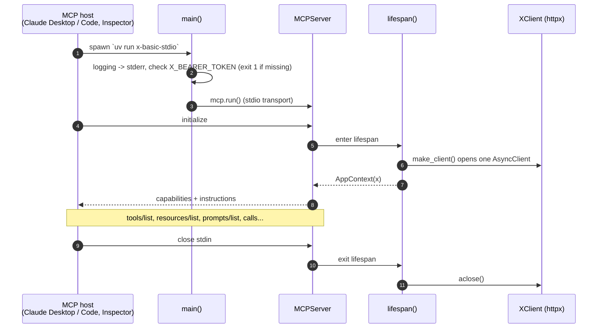
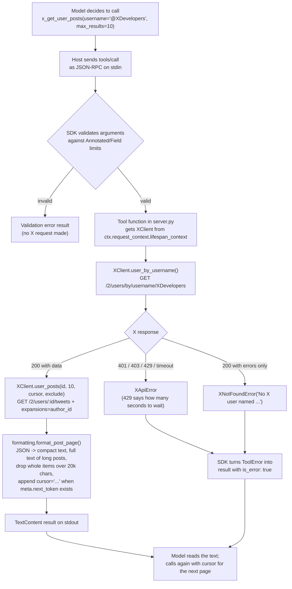
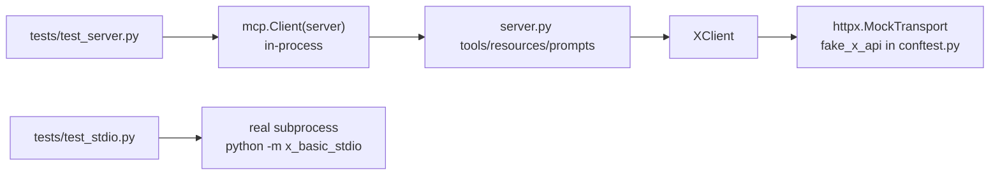

# x-basic-stdio: codebase overview

A tour of how this server is put together and how one request flows through it. For what it
exposes and how to run it, see `README.md`; for the rules when changing it, see `.claude/CLAUDE.md`.

## The pieces

| Layer | File | Responsibility |
|---|---|---|
| Entry point | `__main__.py`, `server.py:main()` | Configure logging to stderr, fail fast without `X_BEARER_TOKEN`, then `mcp.run()` on stdio |
| MCP layer | `server.py` | The `MCPServer`, its `lifespan`, 7 tools, 2 resources, 2 prompts |
| Upstream client | `client.py` | `XClient`: one `httpx.AsyncClient` for `https://api.x.com/2`, one method per endpoint, HTTP errors mapped to `XApiError`, missing items to its subclass `XNotFoundError` |
| Presentation | `formatting.py` | Turns X JSON into compact text (full text of long posts from `note_tweet`), keeps results under `CHARACTER_LIMIT` (20,000) by dropping whole items (always keeping the first), adds the `cursor=...` hint |
| Tests | `tests/` | A fake X API on `httpx.MockTransport`, the in-process `mcp.Client`, and one real stdio smoke test |

`server.py` is split into numbered sections and reads top to bottom:

1. **Shared state**: `AppContext(x: XClient)` and `make_client()` (tests swap this for a fake).
2. **The server**: `MCPServer(name, title, version, instructions, lifespan)`.
3. **Tools**: `x_get_user`, `x_get_users`, `x_get_post`, `x_get_posts`, `x_get_user_posts`,
   `x_get_user_mentions`, `x_search_recent_posts`. All share `READ_ONLY` annotations,
   `structured_output=False`, and reusable argument types (`Username`, `PostId`, `Cursor`,
   `TimelineSize`) whose Pydantic limits land in the input schema.
4. **Resources**: `x://guides/search-operators` (static markdown) and `x://users/{username}`
   (a template that returns JSON and raises `ResourceNotFoundError` or `ResourceError`).
5. **Prompts**: `profile_brief(username)` and `topic_pulse(topic, language)`, which script the
   model into using the tools above.
6. **Run**: `main()`.

## Lifecycle

## Flow of one tool call

Resources follow the same path but translate the client's errors, because a resource failure
is a protocol error, not a tool result: `XNotFoundError` becomes `ResourceNotFoundError`, and any
other `XApiError` (rate limit, auth, network) becomes `ResourceError`.
Prompts make no X calls at all: they only return a message that steers the model toward tools.

## Design choices worth noticing

- **stdout is the protocol.** Every log line goes to stderr; printing to stdout would corrupt
  the JSON-RPC stream.
- **One HTTP client per process**, opened in the `lifespan` and closed on shutdown, so every call
  reuses the connection pool.
- **`client.py` knows nothing about MCP** except `ToolError`, so it can be tested and reused on
  its own, and `server.py` stays about MCP.
- **X's "200 with `errors`" quirk** is handled in one place (`_require_data`, raising `XNotFoundError`), so a missing user
  becomes a clear `ToolError` rather than a `KeyError`.
- **Text, not JSON, for the model.** Results are short lines; typed structured output is left for
  server 02 (`mcp/02-x-advanced`).

## How the tests fit

`conftest.py` replaces `make_client()` with one that uses the mock transport, so no test needs a
token or the network. The stdio tests spawn the real process: one does the handshake and lists
tools with a dummy token, the other checks that it exits with a clear message when the token is
missing.
