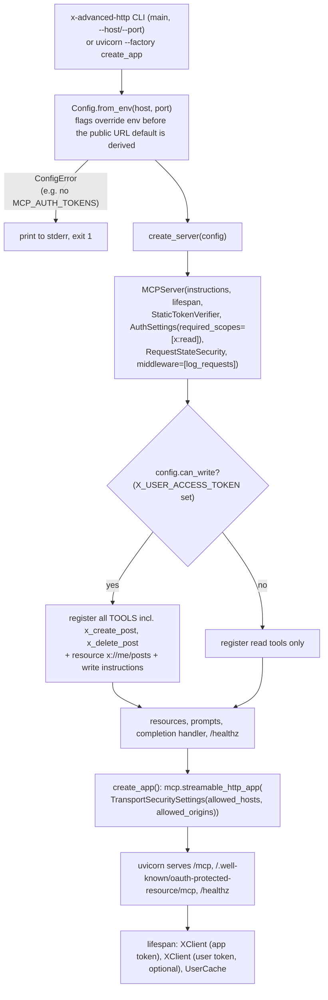
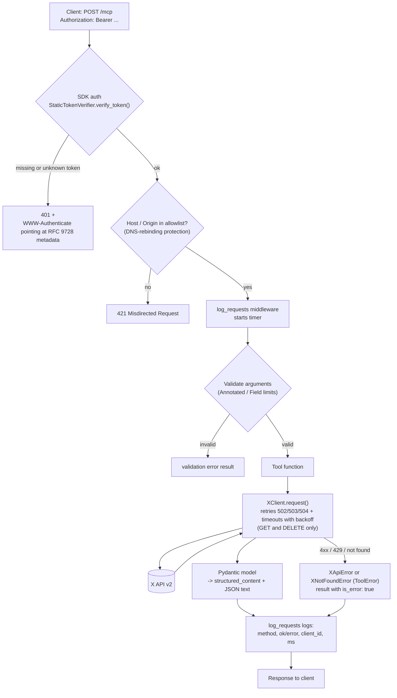
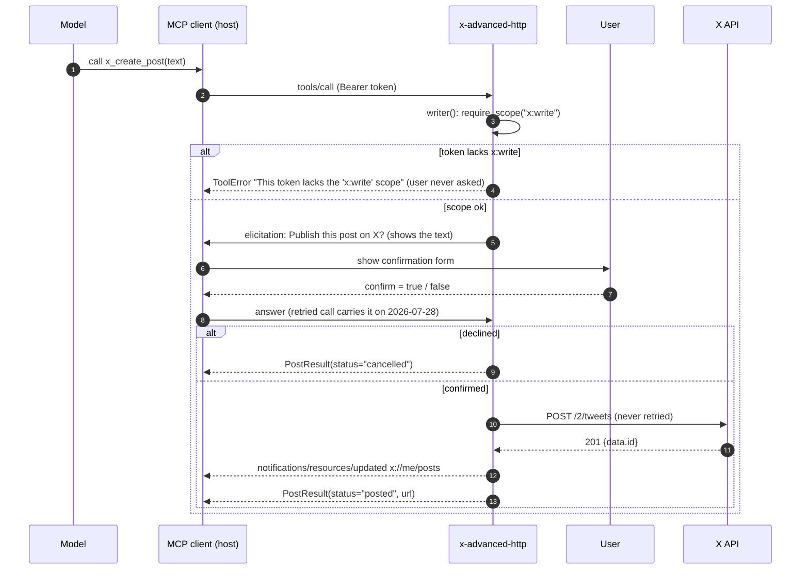
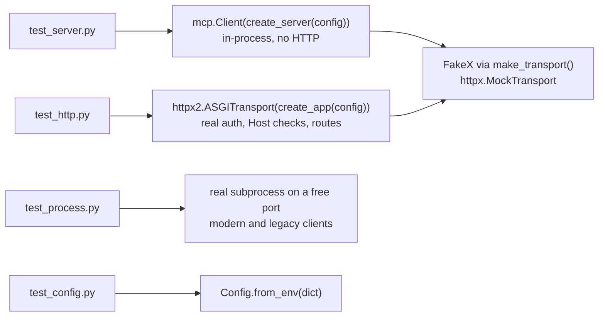

# x-advanced-http: codebase overview

A tour of how this server is put together and how requests flow through it. For what it exposes
and how to run it, see `README.md`; for the rules when changing it, see `.claude/CLAUDE.md`.
Server 01 (`mcp/01-x-basic-stdio`) has the same kind of overview, so the two can be read side by side.

## The pieces

| Layer | File | Responsibility |
|---|---|---|
| Config | `config.py` | `Config.from_env()` reads and validates every env var once at startup; bad values raise `ConfigError` naming the variable |
| Auth | `auth.py` | `StaticTokenVerifier` (constant-time token lookup, returns scopes) and `require_scope()` for per-tool checks |
| MCP layer | `server.py` | Tools, resources, prompts, completions, middleware, and the factories `create_server(config)` / `create_app(config)` |
| Upstream client | `client.py` | `XClient` (reads, writes, retries with backoff on GET/DELETE only) and `UserCache` (5-minute TTL, also feeds completions) |
| Result types | `models.py` | Pydantic models (`User`, `Post`, `PostPage`, `SearchDigest`, `PostResult`, ...) that become each tool's `outputSchema` |
| Tests | `tests/` | `FakeX` on `httpx.MockTransport`; in-process client, in-process HTTP app, and the real process |

`server.py` reads top to bottom: shared state, tools, resources, prompts, completions,
middleware, the factory, then `main()`.

## Startup: from environment to a running app

Tools are plain module-level functions collected by the local `@tool(...)` decorator into
`TOOLS`, because the `MCPServer` only exists once a `Config` does. That is the app-factory
pattern: tests and production differ only in the `Config` they pass.

## One HTTP request, end to end

`/healthz` and the `/.well-known` metadata route skip auth. Note that auth runs before the Host
check, so an unauthenticated request with a bad Host gets 401, not 421.

## Write tools: scope check, then user confirmation

`x_create_post` and `x_delete_post` take two resolved parameters the model cannot see or fill:
`x: Resolve(writer)` and `confirmation: Resolve(confirm_create / confirm_delete)`. The
confirmation resolver itself depends on `writer`, so the scope is checked before the user is
ever asked.

The question is built only from the tool's arguments: on the 2026-07-28 protocol the call is
retried after the answer, and the answer is matched back to that exact question text.
`MCP_STATE_KEYS` lets any worker open the sealed request state when there is more than one.

## Other features and where they live

| Feature | Where | How it works |
|---|---|---|
| Progress | `x_search_digest` | Pages through recent search (up to 500 posts) and calls `ctx.report_progress()` after each page; a no-op if the client didn't ask |
| Structured output | every tool | Return annotation is a Pydantic model, so the tool publishes `outputSchema` and returns `structured_content` |
| Completions | `make_completer(users)` | `language` from a fixed list; `username` from handles in `UserCache`. Has no `Context`, so it closes over the cache |
| Subscriptions | `x://me/posts` | Write tools call `ctx.notify_resource_updated()`; the static resource reads state through the `running` dict the factory closes over |
| Caching | `UserCache`, `lookup_user()`, `AppContext.me_id` | Saves the handle to id lookup that timeline and mentions tools need; the signed-in account's ID is looked up once |
| Mentions | `x_get_user_mentions` | Recent posts mentioning a user, with `next_cursor`, like server 01's tool of the same name |
| Long posts | `models.Post.from_x` | Reads the full text from `note_tweet` for posts over 280 characters |
| Lost DELETE responses | `x_delete_post` | If X answers `deleted: false` (a retry after a lost response), the tool looks the post up and treats it as deleted when it is gone |
| Resource errors | `user_profile` | `XNotFoundError` becomes `ResourceNotFoundError`; other X failures become `ResourceError` |
| Middleware | `log_requests` | Logs method, outcome, `client_id` (a hash, never the token) and duration |

## How the tests fit

No test needs a real X token or the network. Legacy (2025-11-25) sessions are tested in-memory
or against the real process, because `ASGITransport` buffers responses and those sessions hang
against the in-process app.
